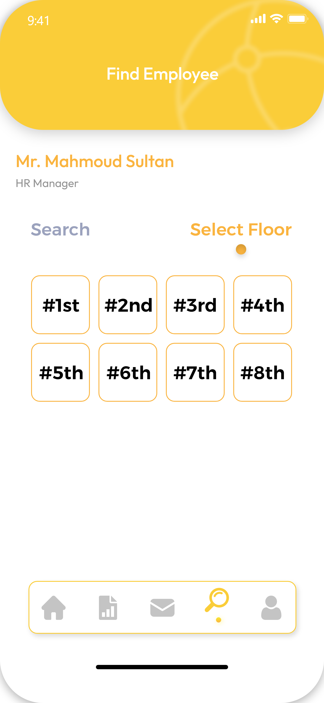
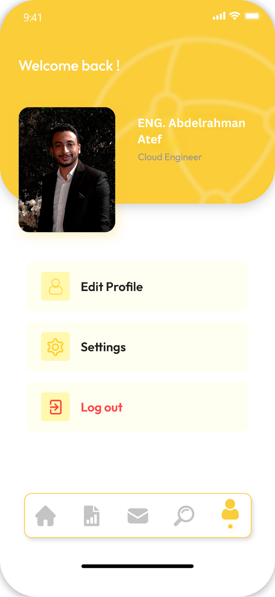

# Sense More

Sense More is a smart attendance tracking system for companies and organizations, using indoor tracking. The system allows managers to easily track employee attendance, search and filter employees, communicate via chat, receive company announcements and updates, and view employee statistics such as consumed and remaining vacation days.


## Features

- Track employees' activities indoor
- Filter employees based on different criteria
- Chat between employees
- Share announcements and updates in the company
- View employee statistics

## Technology

- The app is built using Flutter, which is a UI toolkit for building natively compiled applications for mobile, web, and desktop from a single codebase.
- The backend is powered by Firebase, which is a mobile and web application development platform that provides a comprehensive suite of tools for building scalable, secure, and reliable apps.

## UI Screenshots

<a href="https://drive.google.com/file/d/1B2fuTr2UfSitV4Ae_uIDdzviQYUVL3Ak/view" target="_blank">Watch the video here</a>
<div style="display: flex; flex-wrap: wrap; gap: 10px;">
  <div style="flex: 1 1 45%; text-align: center;">
    
    <p>Login</p>
  </div>
  <div style="flex: 1 1 45%; text-align: center;">
    
    <p>Home</p>
  </div>
  <div style="flex: 1 1 45%; text-align: center;">
    
    <p>Messages</p>
  </div>
  <div style="flex: 1 1 45%; text-align: center;">
    
    <p>Profile</p>
  </div>
  <div style="flex: 1 1 45%; text-align: center;">
    
    <p>Find Employee Text Search</p>
  </div>
  <div style="flex: 1 1 45%; text-align: center;">
    
    <p>Find Employee Floor Search</p>
  </div>
  <div style="flex: 1 1 45%; text-align: center;">
    
    <p>Find Employee Floor Search 2</p>
  </div>
  <div style="flex: 1 1 45%; text-align: center;">
    
    <p>Find Employee No Access</p>
  </div>
  <div style="flex: 1 1 45%; text-align: center;">
    
    <p>Settings Menu</p>
  </div>
  <div style="flex: 1 1 45%; text-align: center;">
    
    <p>Edit Profile</p>
  </div>
</div>

## Getting Started

To run the app locally, follow these steps:

1. Clone the repository:
   
```git clone https://github.com/your-username/employee-tracking-system.git```


2. Navigate to the project directory:

```cd employee-tracking-system```


3. Install the dependencies:

```flutter pub get```

4. Run the app:

```flutter run```


## Contributing

If you'd like to contribute to the project, please follow these guidelines:

1. Fork the repository.

2. Create a new branch:

```git checkout -b feature/your-feature```

3. Make your changes and commit them:

```git commit -m 'Add some feature'```

4. Push to the branch:

```git push origin feature/your-feature```


5. Submit a pull request.

## License

This project is licensed under the `MIT License` - see the [LICENSE](LICENSE) file for details.
